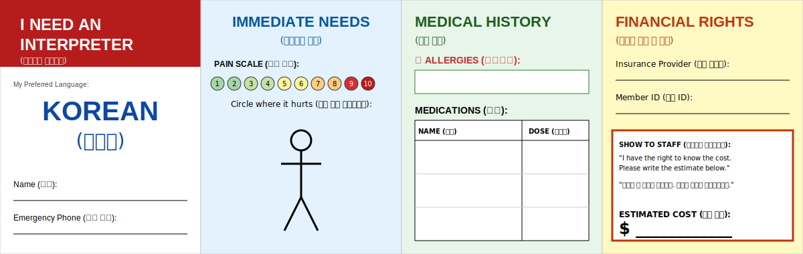

Start with: 

```pip install openai python-dotenv```

Create an `.env` file and place your OpenAI key inside. It should look something like `OPENAI_API_KEY=sk-...`. 

run `python generate_card_CLI.py` and enter the name of the language you want to generate a card in

The card will appear in `/output` as a `.svg` file which you can import into Figma to customize and download as a png to print

Alternatively,

run `python generate_pamphlet_CLI.py` and enter the name of the language you want to generate a pamphlet in

The card will appear in `/output` as a `.html` file which you can print

Example of card:


[Example of pamphlet](/output/pamphlet_german.html)